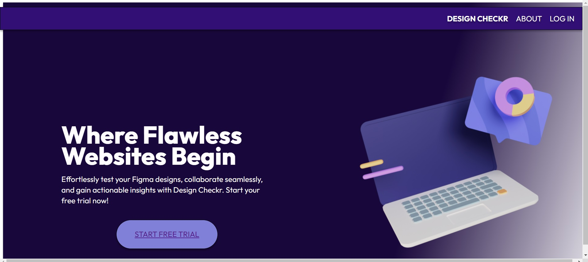
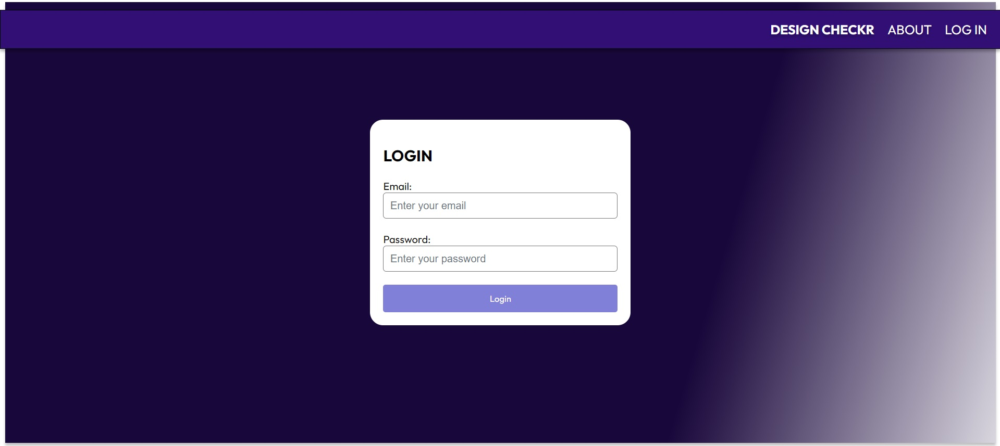

# Design-Checkr

Design-Checkr is a login page that I am currently exploring.

## Screenshots




## Prerequisites

Before you begin, ensure you have the following installed on your machine:
- [Node.js](https://nodejs.org/) (to run npm commands)
- [Angular CLI](https://cli.angular.io/) (to serve the Angular app)
- [PrimeNG](https://primefaces.org/primeng/) (to use PrimeNG components)

## Getting Started

To get a local copy up and running, follow these simple steps:

### Installation

1. Clone the repository
    ```bash
    git clone https://github.com/stevenalecreyes/Design-Checkr.git
    ```

2. Navigate to the project directory
    ```bash
    cd Design-Checkr/design-checkr-app
    ```

3. Install dependencies
    ```bash
    npm install
    ```

### Running the App

1. After installation, you can run the app locally using Angular CLI.
    ```bash
    ng serve
    ```

2. Open your browser and navigate to `http://localhost:4200/` to view the app.

## Usage

Once the app is running, you can explore the login page and interact with its features.